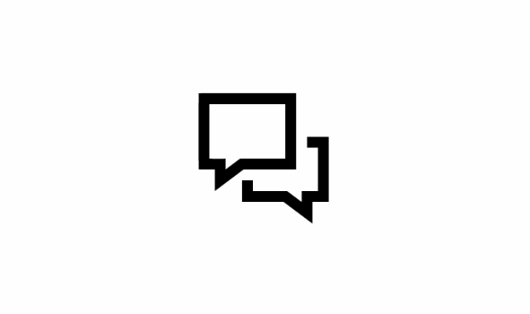

# BadgeControl
* Simply attach BadgeController to any UIView's subclasses and easily control the badge.
* Customize size, position, background color, text color, border width, border color and animation of the badge.

## Setup
#### Setup with CocoaPods (iOS 9+)
* If you are using CocoaPods add this text to your Podfile and run `pod install`.

~~~ruby 
    pod 'BadgeControl'
~~~
#### Add source (iOS 9+)
* Add [BadgeController.swift](https://github.com/kiwisip/BadgeControl/blob/master/BadgeControl/BadgeController.swift), [BadgeView.swift](https://github.com/kiwisip/BadgeControl/blob/master/BadgeControl/BadgeView.swift), [BadgeCenterPosition.swift](https://github.com/kiwisip/BadgeControl/blob/master/BadgeControl/BadgeCenterPosition.swift) and [BadgeAnimations.swift](https://github.com/kiwisip/BadgeControl/blob/master/BadgeControl/BadgeAnimations.swift) to your project.

## Usage
Add `import BadgeControl` to your source code (unless you used the file setup method).   
Simply attach BadgeController to your UIView (or its subclass).

~~~swift
let badge = BadgeController(for: myUIView)
~~~

Add an empty badge and present it with animation.

~~~swift
badge.addOrReplaceCurrent(animated: true)
~~~

Add a badge with text and present it with animation.

~~~swift
badge.addOrReplaceCurrent(with: "1", animated: true)
~~~

Remove badge from its view.

~~~swift
badge.remove(animated: true)
~~~

Simply increment or decrement the value on your badge (if it is numeric) and present it with animation.

~~~swift
badge.increment(animated: true)
badge.decrement(animated: true)
~~~

You can also set `animateOnlyWhenBadgeIsNotYetPresent = true` if you don't want animation when badge is already present on the view.

## Customization
You can customize badge's text font, background color, text color, border width, border color, size, center position and animation.

#### Text font, background color, text color, border width, border color and size
~~~swift
badge.badgeTextFont = UIFont.systemFont(ofSize: 15)
badge.badgeBackgroundColor = UIColor.blue
badge.badgeTextColor = UIColor.yellow
badge.borderWidth = 3 // in px
badge.borderColor = UIColor.black // black is default
badge.badgeHeight = 20 // badge will have height of 20px
~~~

#### Center position
You can choose following center positions: upperLeftCorner, upperRightCorner, lowerLeftCorner, lowerRightCorner. 

You can also choose custom position by calling .custom(x: Double, y: Double).

~~~swift
badge.centerPosition = .upperLeftCorner
badge.centerPosition = .custom(x: 10, y: 20)
~~~

#### Animations
You can choose one of the following animations:

###### Default animation

~~~swift
badge.animation = BadgeAnimations.default
~~~

###### Left-right animation

~~~swift
badge.animation = BadgeAnimations.leftRight
~~~

###### Right-left animation

~~~swift
badge.animation = BadgeAnimations.rightLeft
~~~

###### Fade in animation

~~~swift
badge.animation = BadgeAnimations.fadeIn
~~~

###### Rolling animation

~~~swift
badge.animation = BadgeAnimations.rolling
~~~

###### Custom
You can also provide your own animation of type ((UIView) -> Void).

~~~swift
badge.animation = { badgeView in
    ...
  }
~~~

#### Initialization
You can use this initalizer with default values:

~~~swift
public init(for view: UIView,
            in centerPosition: BadgeCenterPosition = .upperRightCorner,
            badgeBackgroundColor: UIColor = .red,
            badgeTextColor: UIColor = .white,
            badgeTextFont: UIFont? = nil,
            borderWidth: CGFloat = 0.0,
            borderColor: UIColor = .black,
            animation: ((UIView) -> Void)? = BadgeAnimations.defaultAnimation,
            badgeHeight: Int? = nil
            animateOnlyWhenBadgeIsNotYetPresent: Bool = false)
~~~

## License

BadgeControl is released under the [MIT License](LICENSE).

## Feedback is welcome

If you've found a bug or want to improve BadgeControl feel free to create an issue.
